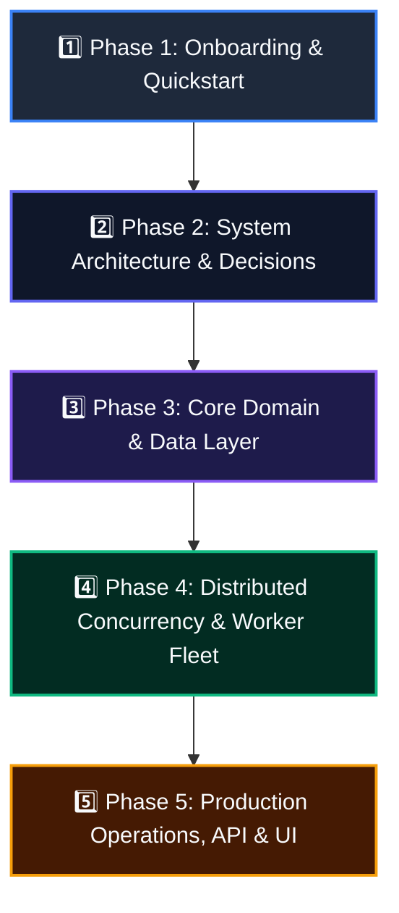

# Distributed Job Scheduler — Sequential Reading & Learning Guide

Welcome to the **Distributed Job Scheduler** project! This sequential guide is designed for developers, architects, and evaluators who want to understand the system completely from start to finish.

Read through the documentation files in the **numbered order below** to build a comprehensive understanding of the system, from high-level concepts to deep database internals, concurrency models, and deployment workflows.

---

## 🗺️ Documentation Learning Roadmap



---

## 1️⃣ Phase 1: Getting Started & High-Level Overview

Start here to understand what the project is, what problems it solves, and how to get it running on your local machine in under 2 minutes.

|  Step  | File                                                    | Description & What You Will Learn                                                                                                                                        |
| :----: | ------------------------------------------------------- | ------------------------------------------------------------------------------------------------------------------------------------------------------------------------ |
| **01** | [**`README.md`**](file:///d:/Job%20Scheduler/README.md) | **Project Overview & Highlights**: Core capabilities, tech stack (PostgreSQL, Redis, Express, React, TypeScript), directory structure, and features summary.             |
| **02** | [**`Run.md`**](file:///d:/Job%20Scheduler/Run.md)       | **Complete Setup & Execution Guide**: Prerequisites, environment variables setup, database migrations, running the worker fleet, scheduler, API, and frontend dashboard. |

---

## 2️⃣ Phase 2: System Architecture & Engineering Decisions

Understand the architectural blueprints, high-level component diagrams, lifecycle flows, and the technical reasoning behind key engineering decisions.

|  Step  | File                                                                                  | Description & What You Will Learn                                                                                                                                                                                   |
| :----: | ------------------------------------------------------------------------------------- | ------------------------------------------------------------------------------------------------------------------------------------------------------------------------------------------------------------------- |
| **03** | [**`docs/architecture.md`**](file:///d:/Job%20Scheduler/docs/architecture.md)         | **System Architecture & Lifecycle Sequence Diagrams**: End-to-end Mermaid architecture diagrams, execution lifecycles, happy path sequence flows, and failure/DLQ flows.                                            |
| **04** | [**`docs/design-decisions.md`**](file:///d:/Job%20Scheduler/docs/design-decisions.md) | **Engineering Design Decisions & Trade-offs**: 20 deep architectural explanations covering why PostgreSQL, why `SKIP LOCKED`, row-level locking, queue concurrency, leader election, and honest trade-off analysis. |

---

## 3️⃣ Phase 3: Core Domain & Data Layer

Dive into the relational data models, multi-tenant isolation boundaries, role-based access control (RBAC), and queue management.

|  Step  | File                                                                                                            | Description & What You Will Learn                                                                                                                                                                  |
| :----: | --------------------------------------------------------------------------------------------------------------- | -------------------------------------------------------------------------------------------------------------------------------------------------------------------------------------------------- |
| **05** | [**`docs/01_database_architecture.md`**](file:///d:/Job%20Scheduler/docs/01_database_architecture.md)           | **Database Architecture & Schema Design**: Schema structure, tables (`jobs`, `queues`, `workers`, `job_executions`), constraints, composite indexes, and data integrity.                           |
| **06** | [**`docs/02_auth_and_authorization.md`**](file:///d:/Job%20Scheduler/docs/02_auth_and_authorization.md)         | **Authentication & RBAC**: JWT Bearer validation (`HS256`), SHA-256 API key hashing, permissions hierarchy (`Owner`, `Admin`, `Member`, `Viewer`).                                                 |
| **07** | [**`docs/03_organizations_and_projects.md`**](file:///d:/Job%20Scheduler/docs/03_organizations_and_projects.md) | **Multi-Tenancy & Project Isolation**: Hierarchical tenant modeling (`Organizations` $\rightarrow$ `Projects` $\rightarrow$ `Queues` $\rightarrow$ `Jobs`) and cross-tenant data isolation guards. |
| **08** | [**`docs/04_queue_management.md`**](file:///d:/Job%20Scheduler/docs/04_queue_management.md)                     | **Queue Management & Concurrency Limits**: Queue configuration, priority tuning (1–10), concurrency limits (1–1000), and pausing/resuming queues dynamically.                                      |
| **09** | [**`docs/05_job_domain_and_lifecycle.md`**](file:///d:/Job%20Scheduler/docs/05_job_domain_and_lifecycle.md)     | **Job Domain & State Machine**: Job types (`immediate`, `delayed`, `scheduled`, `recurring`, `batch`), status transitions, priority ordering, and timeouts.                                        |

---

## 4️⃣ Phase 4: Distributed Concurrency, Workers & Fault Tolerance

Learn how the system prevents race conditions, enforces queue concurrency limits, handles node crashes, and manages exponential retries and dead letters.

|  Step  | File                                                                                                                        | Description & What You Will Learn                                                                                                                                                |
| :----: | --------------------------------------------------------------------------------------------------------------------------- | -------------------------------------------------------------------------------------------------------------------------------------------------------------------------------- |
| **10** | [**`docs/06_distributed_job_claiming.md`**](file:///d:/Job%20Scheduler/docs/06_distributed_job_claiming.md)                 | **Distributed Job Claiming & Locking**: Deep dive into `SELECT ... FOR UPDATE SKIP LOCKED`, two-statement queue-level row locking, and preventing snapshot race conditions.      |
| **11** | [**`docs/07_worker_service.md`**](file:///d:/Job%20Scheduler/docs/07_worker_service.md)                                     | **Worker Fleet & Execution Engine**: Worker daemon architecture, local concurrency pools, dynamic project auto-discovery, handler registration, and graceful `SIGTERM` draining. |
| **12** | [**`docs/08_retry_policy_system.md`**](file:///d:/Job%20Scheduler/docs/08_retry_policy_system.md)                           | **Retry Policy & Exponential Backoff**: Exponential/linear/fixed retry formulas, full jitter variance calculation, backoff multiplier curves, and retry state management.        |
| **13** | [**`docs/09_dead_letter_queue.md`**](file:///d:/Job%20Scheduler/docs/09_dead_letter_queue.md)                               | **Dead Letter Queue (DLQ)**: Quarantining permanently failed jobs, error stack capture, worker node forensic tracking, and replaying dead jobs.                                  |
| **14** | [**`docs/11_scheduler_service.md`**](file:///d:/Job%20Scheduler/docs/11_scheduler_service.md)                               | **Distributed Scheduler & Cron Engine**: 5-field cron parsing, delayed job promotion, and Redis Redlock distributed leader election (`SET NX PX`).                               |
| **15** | [**`docs/12_worker_heartbeat_monitoring.md`**](file:///d:/Job%20Scheduler/docs/12_worker_heartbeat_monitoring.md)           | **Worker Liveness & Stale Node Reaper**: 5-second heartbeat ping loops, 30-second timeout detection, and automatic orphaned running job recovery.                                |
| **16** | [**`docs/10_system_overview_and_verification.md`**](file:///d:/Job%20Scheduler/docs/10_system_overview_and_verification.md) | **System Verification & Concurrency Test Suite**: High-concurrency test suites (13 scenario integration suite + flagship 100-job multi-worker stress test).                      |

---

## 5️⃣ Phase 5: REST API, Web Dashboard & Operations

Explore the external interfaces, interactive UI, metrics telemetry, error handling, and troubleshooting guides.

|  Step  | File                                                                                                                                | Description & What You Will Learn                                                                                                                                                            |
| :----: | ----------------------------------------------------------------------------------------------------------------------------------- | -------------------------------------------------------------------------------------------------------------------------------------------------------------------------------------------- |
| **17** | [**`api.md`**](file:///d:/Job%20Scheduler/api.md)                                                                                   | **Complete REST API Documentation**: Full endpoint directory with HTTP methods, URLs, auth headers, JSON schemas, parameters, cURL examples, and status codes.                               |
| **18** | [**`docs/13_api_standards_and_openapi.md`**](file:///d:/Job%20Scheduler/docs/13_api_standards_and_openapi.md)                       | **API Standards & Swagger UI**: Request correlation IDs (`X-Request-Id`), rate limiting headers, error envelopes, and interactive Swagger UI (`/api/v1/docs`).                               |
| **19** | [**`docs/14_production_observability_and_metrics.md`**](file:///d:/Job%20Scheduler/docs/14_production_observability_and_metrics.md) | **Observability, Metrics & Prometheus**: Percentile duration metrics ($p50, p95, p99$), throughput telemetry, Winston log redaction, and Prometheus scrapers (`/api/v1/metrics/prometheus`). |
| **20** | [**`uiguide.md`**](file:///d:/Job%20Scheduler/uiguide.md)                                                                           | **Web Dashboard User Guide**: Interactive UI guide covering the Overview Dashboard, 20-item paginated Queue Backlog table, Jobs Explorer, DLQ Inspector, and Workers monitor.                |
| **21** | [**`docs/15_react_dashboard_application.md`**](file:///d:/Job%20Scheduler/docs/15_react_dashboard_application.md)                   | **Frontend Architecture**: React 18 component structure, state management, auto-polling telemetry hooks, routing, and Tailwind styling.                                                      |
| **22** | [**`errors.md`**](file:///d:/Job%20Scheduler/errors.md)                                                                             | **Error Catalog & Troubleshooting Guide**: Comprehensive directory of API error codes, database constraint errors (`23514`, `23505`, `23503`), common pitfalls, and fixes.                   |
| **23** | [**`docs/audit_report.md`**](file:///d:/Job%20Scheduler/docs/audit_report.md)                                                         | **Engineering Review & Audit Report**: Senior engineering audit, requirement coverage matrix, high-concurrency analysis, and test verification results.       |

---

## 💡 Quick Tips for New Contributors

1. **To run the full test suite**:
   ```bash
   npm test
   ```
2. **To start the complete development environment**:
   ```bash
   npm run dev
   ```
3. **To access the interactive Swagger API docs**:
   Open [`http://localhost:3000/api/v1/docs`](http://localhost:3000/api/v1/docs) in your browser while the API is running.
4. **To view the React Web Dashboard**:
   Open [`http://localhost:5173`](http://localhost:5173) in your browser while the frontend dev server is running.
