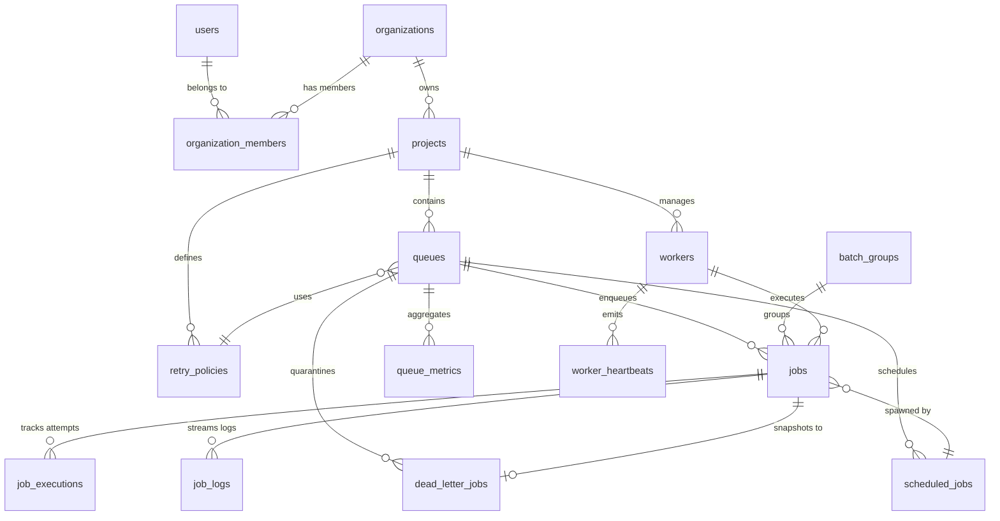

# Step 1: Database Architecture & Relational Schema

## Overview

The distributed job scheduler relies on **PostgreSQL 17** as the single, durable source of truth. The database is strictly normalized into a relational schema that enforces data integrity, multi-tenant resource hierarchies, high-throughput job queries, and comprehensive audit history.

---

## 1. Entity-Relationship Model & Schema Hierarchy

---

## 2. Table Specifications

### 1. `users`
- **Purpose**: Authenticated user identity and credentials.
- **Columns**: `id` (UUID PK), `email` (UNIQUE VARCHAR), `password_hash` (VARCHAR), `name` (VARCHAR), `is_active` (BOOL), `created_at`, `updated_at`.
- **Integrity**: Enforces unique, normalized lowercase emails and active account states.

### 2. `organizations` & `organization_members`
- **Purpose**: Top-level tenant boundaries and role-based access control (RBAC).
- **Columns (`organizations`)**: `id` (UUID PK), `name` (VARCHAR), `slug` (UNIQUE VARCHAR), `created_at`, `updated_at`.
- **Columns (`organization_members`)**: `id` (UUID PK), `organization_id` (FK), `user_id` (FK), `role` (ENUM: `owner`, `admin`, `member`, `viewer`), `joined_at`.
- **Constraint**: `UNIQUE (organization_id, user_id)` ensures unique membership per organization.

### 3. `projects`
- **Purpose**: Logical grouping of queues, jobs, and workers within an organization.
- **Columns**: `id` (UUID PK), `organization_id` (FK CASCADE), `name` (VARCHAR), `slug` (VARCHAR), `description` (TEXT), `created_at`, `updated_at`.
- **Constraint**: `UNIQUE (organization_id, slug)` guarantees distinct project namespaces per tenant.

### 4. `retry_policies`
- **Purpose**: Centralized, reusable mathematical backoff policies.
- **Columns**: `id` (UUID PK), `project_id` (FK CASCADE), `name` (VARCHAR), `strategy` (ENUM: `fixed`, `linear`, `exponential`), `max_attempts` (SMALLINT, 1-100), `initial_delay_ms` (INT), `max_delay_ms` (INT), `backoff_multiplier` (NUMERIC), `jitter_ms` (INT), `created_at`, `updated_at`.

### 5. `queues`
- **Purpose**: Independent processing channels with priority, concurrency, and DLQ controls.
- **Columns**: `id` (UUID PK), `project_id` (FK CASCADE), `retry_policy_id` (FK SET NULL), `name` (VARCHAR), `description` (TEXT), `priority` (SMALLINT 1-10), `concurrency_limit` (INT), `dlq_enabled` (BOOL), `status` (ENUM: `active`, `paused`, `archived`), `paused_at`, `created_at`, `updated_at`.
- **Constraint**: `UNIQUE (project_id, name)`.

### 6. `batch_groups`
- **Purpose**: Tracks atomic parent-child batch job submissions with $O(1)$ progress counters.
- **Columns**: `id` (UUID PK), `queue_id` (FK CASCADE), `name` (VARCHAR), `total_count`, `pending_count`, `running_count`, `completed_count`, `failed_count`, `dead_count`, `created_at`, `updated_at`.

### 7. `jobs` (Core High-Volume Table)
- **Columns**: `id` (UUID PK), `queue_id` (FK CASCADE), `worker_id` (FK SET NULL), `batch_group_id` (FK SET NULL), `scheduled_job_id` (FK SET NULL), `name` (VARCHAR), `type` (ENUM: `immediate`, `delayed`, `scheduled`, `recurring`, `batch_child`), `status` (ENUM: `pending`, `delayed`, `scheduled`, `running`, `completed`, `failed`, `dead`, `cancelled`), `payload` (JSONB), `priority` (SMALLINT), `scheduled_at`, `run_at`, `attempt_count`, `max_attempts`, `next_attempt_at`, `timeout_ms`, `result` (JSONB), `error_message` (TEXT), `error_code` (VARCHAR), `enqueued_at`, `started_at`, `finished_at`, `created_at`, `updated_at`.

### 8. `job_executions`
- **Purpose**: Full execution attempt audit history.
- **Columns**: `id` (UUID PK), `job_id` (FK CASCADE), `worker_id` (FK SET NULL), `attempt_number` (SMALLINT), `status` (VARCHAR), `started_at`, `finished_at`, `duration_ms` (GENERATED ALWAYS AS $((\text{finished\_at} - \text{started\_at}) \times 1000)$ STORED), `result` (JSONB), `error_message` (TEXT), `error_code` (VARCHAR), `next_retry_at`, `retry_delay_ms`, `created_at`.
- **Constraint**: `UNIQUE (job_id, attempt_number)`.

### 9. `job_logs`
- **Purpose**: High-volume append-only log streaming.
- **Columns**: `id` (BIGSERIAL PK), `job_id` (FK CASCADE), `execution_id` (FK CASCADE), `level` (ENUM: `debug`, `info`, `warn`, `error`), `message` (TEXT), `metadata` (JSONB), `logged_at`.

### 10. `workers` & `worker_heartbeats`
- **Purpose**: Active worker node registration and liveness telemetry.
- **Columns (`workers`)**: `id` (UUID PK), `project_id` (FK CASCADE), `hostname` (VARCHAR), `pid` (INT), `status` (ENUM: `active`, `draining`, `offline`), `max_concurrency` (INT), `current_job_count` (INT), `last_heartbeat_at`, `registered_at`, `created_at`, `updated_at`.

### 11. `scheduled_jobs`
- **Purpose**: Recurring cron schedule definitions.
- **Columns**: `id` (UUID PK), `queue_id` (FK CASCADE), `name` (VARCHAR), `cron_expression` (VARCHAR), `timezone` (VARCHAR), `payload_template` (JSONB), `enabled` (BOOL), `next_run_at`, `last_fired_at`, `created_at`, `updated_at`.

### 12. `dead_letter_jobs`
- **Purpose**: Quarantined job snapshots after exhausted retries or fatal errors.
- **Columns**: `id` (UUID PK), `job_id` (UNIQUE FK CASCADE), `queue_id` (FK CASCADE), `name` (VARCHAR), `payload` (JSONB), `total_attempts` (SMALLINT), `final_error_message` (TEXT), `final_error_code` (VARCHAR), `failed_worker_id` (FK SET NULL), `status` (VARCHAR: `unhandled`, `retried`, `archived`), `first_failed_at`, `last_failed_at`, `moved_to_dlq_at`, `requeued_at`, `requeued_job_id`, `requeued_by`, `archived_at`, `archived_by`, `created_at`.

---

## 3. High-Performance Indexing Strategy

| Index Name | Table & Columns | Filter / Type | Purpose |
| :--- | :--- | :--- | :--- |
| `idx_jobs_claim` | `jobs(queue_id, priority DESC, enqueued_at ASC)` | `WHERE status = 'pending'` | $O(\log n)$ atomic job claiming seeking |
| `idx_jobs_running_per_queue` | `jobs(queue_id)` | `WHERE status = 'running'` | Concurrency limit checking without full scan |
| `idx_jobs_retry_eligible` | `jobs(next_attempt_at ASC)` | `WHERE status = 'failed'` | Retry promotion polling index |
| `idx_jobs_scheduled_promotion`| `jobs(scheduled_at ASC)` | `WHERE status = 'scheduled'` | Delayed / scheduled job discovery |
| `idx_job_executions_job_attempt`| `job_executions(job_id, attempt_number)`| Unique Index | Execution history ordering seek |
| `idx_job_logs_job_logged` | `job_logs(job_id, logged_at ASC)` | B-Tree | Log streaming for API queries |
| `idx_dlq_queue_status_moved` | `dead_letter_jobs(queue_id, status, moved_to_dlq_at DESC)` | B-Tree | DLQ dashboard and queue filtering |
