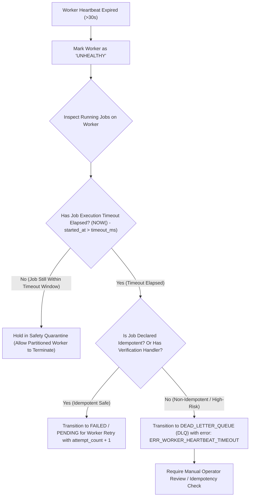

# Worker Heartbeat Monitoring & Stale Worker Recovery

## Overview

In a distributed job scheduler, worker nodes can crash, experience hardware failure, undergo long garbage collection (GC) pauses, or suffer network partitions. The **Worker Heartbeat Monitoring System** tracks worker node liveness, updates health telemetry, detects stale/unhealthy nodes, and manages orphaned job states with strict reliability guarantees.

---

## 1. Worker Lifecycle States

| State | Enum Key | Definition |
| :--- | :--- | :--- |
| **`ONLINE`** | `online` | Worker is active, emitting periodic heartbeats, and has spare capacity (`currentJobCount < maxConcurrency`). |
| **`BUSY`** | `busy` | Worker is active, emitting periodic heartbeats, but running at full capacity (`currentJobCount >= maxConcurrency`). |
| **`UNHEALTHY`** | `unhealthy` | Worker has missed heartbeats beyond the timeout threshold (`last_heartbeat_at < NOW() - thresholdSeconds`). |
| **`STOPPED`** | `stopped` | Worker process has cleanly drained, reported stop telemetry, and shut down. |

---

## 2. Heartbeat Mechanism & Data Model

1. **Periodic Heartbeat Emission**:
   - Active workers periodically emit heartbeats (default: every $10\text{ s}$) via `Worker.sendHeartbeat()` or `POST /api/v1/workers/:workerId/heartbeat`.
   - Sends payload: `{ currentJobCount: number, metadata: { cpu, memory, queueDepths } }`.
2. **Database Updates**:
   - Updates `workers.last_heartbeat_at = NOW()`.
   - Updates `workers.current_job_count = currentJobCount`.
   - Automatically transitions status between `ONLINE` and `BUSY` based on capacity.
   - Appends an immutable time-series record into `worker_heartbeats` for historical telemetry and liveness graphs.

---

## 3. Stale Worker Detection

- The monitor identifies workers where `status NOT IN ('unhealthy', 'stopped', 'offline')` and `last_heartbeat_at < NOW() - 30 seconds`.
- Updates their status in `workers` table to `UNHEALTHY`.
- Emits alerts to operator logs and telemetry dashboards.

---

## 4. Reliability Trade-Off: Handling Jobs on Unhealthy Workers

### The Problem: The "At-Least-Once vs At-Most-Once" Dilemma

When a worker's heartbeat expires, the distributed system cannot definitively distinguish between three scenarios:
1. **Scenario A (Clean Crash)**: The worker process crashed (e.g. SIGKILL / OOM), and the in-flight job **did not finish**.
2. **Scenario B (Network Partition / GC Pause)**: The worker is still alive and **still executing the job in the background**, but unable to reach PostgreSQL.
3. **Scenario C (Completed with Lost ACK)**: The worker **successfully completed the business logic** (e.g. charged a customer's credit card or sent an external webhook), but lost power/network right before writing `status = 'completed'` to the database.

> [!CAUTION]
> **The Duplicate Execution Hazard**:
> If the scheduler blindly resets all running jobs on an unhealthy worker back to `pending` immediately:
> - In Scenario B, two workers will run the same job concurrently $\rightarrow$ **Race conditions and state corruption**.
> - In Scenario C, the job will run a second time $\rightarrow$ **Double charging / duplicate side-effects**.

---

### Safe Resolution Design

To preserve execution safety, the system enforces the following recovery protocol:



1. **Timeout Elapsed Quarantine**:
   - The scheduler checks `jobs.started_at + jobs.timeout_ms`.
   - If the job is still within its execution timeout window, the system **holds the job in quarantine** to allow the partitioned worker's local execution abort signal to fire.
2. **Idempotency Verification**:
   - Jobs flagged as idempotent or supporting status verification can safely be re-queued.
3. **Quarantine to DLQ for Non-Idempotent Work**:
   - Non-idempotent jobs that were active on dead workers are transitioned to `dead` state with error code `ERR_WORKER_HEARTBEAT_TIMEOUT` and stored in `dead_letter_jobs` for operator review, preventing silent double-execution disasters.

---

## 5. REST APIs Implemented

### 1. List Workers
- **`GET /api/v1/workers`**
- **Query Parameters**: `projectId`, `status`, `page`, `pageSize`.
- Returns paginated list of workers with real-time calculated health status (`online`, `busy`, `unhealthy`, `stopped`).

### 2. Inspect Single Worker
- **`GET /api/v1/workers/:workerId`**
- Returns complete worker profile, recent time-series heartbeats, and array of currently assigned running jobs.

### 3. Register Worker Node
- **`POST /api/v1/workers/register`**
- **Body**: `{ "projectId": "...", "hostname": "node-01", "pid": 1204, "maxConcurrency": 10 }`

### 4. Record Worker Heartbeat
- **`POST /api/v1/workers/:workerId/heartbeat`**
- **Body**: `{ "currentJobCount": 4, "metadata": { "cpu": 25.4, "memMb": 340 } }`

### 5. Scan Stale Workers
- **`POST /api/v1/workers/stale/scan?timeoutSeconds=30`**
- Identifies and transitions stale workers to `unhealthy`.

### 6. Clean Worker Stop
- **`POST /api/v1/workers/:workerId/stop`**
- Marks worker status as `stopped`.

---

## 6. Automated Verification

Ran `npx vitest run api/workers.test.ts`:

```text
✓ api/workers.test.ts (10 tests)
  ✓ 1. Worker Registration > registers a new worker node process with initial ONLINE status
  ✓ 1. Worker Registration > rejects worker registration by unauthorized user with 403 Forbidden
  ✓ 2. Periodic Heartbeat Updates & State Transitions > records heartbeat and keeps status ONLINE when running below max concurrency
  ✓ 2. Periodic Heartbeat Updates & State Transitions > dynamically transitions status to BUSY when running at full concurrency capacity
  ✓ 2. Periodic Heartbeat Updates & State Transitions > transitions back to ONLINE when job count drops below concurrency limit
  ✓ 3. Worker Listing & Health Status Evaluation > lists workers for the project with pagination and calculated health status
  ✓ 4. Worker Inspection & Telemetry > retrieves detailed worker telemetry with recent heartbeats and assigned running jobs
  ✓ 4. Worker Inspection & Telemetry > returns 404 for non-existent worker ID
  ✓ 5. Stale Worker Detection (Heartbeat Expiry) > scans and identifies workers whose heartbeat has expired and transitions them to UNHEALTHY
  ✓ 6. Clean Worker Stop & Deregistration > marks a worker as STOPPED when stopping cleanly

Test Files  1 passed (1)
     Tests  10 passed (10)
```
