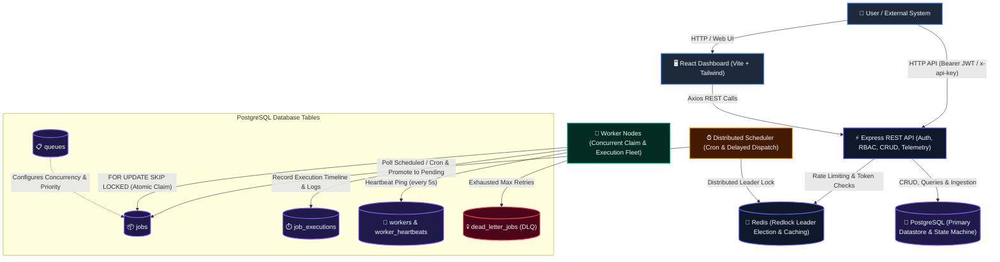
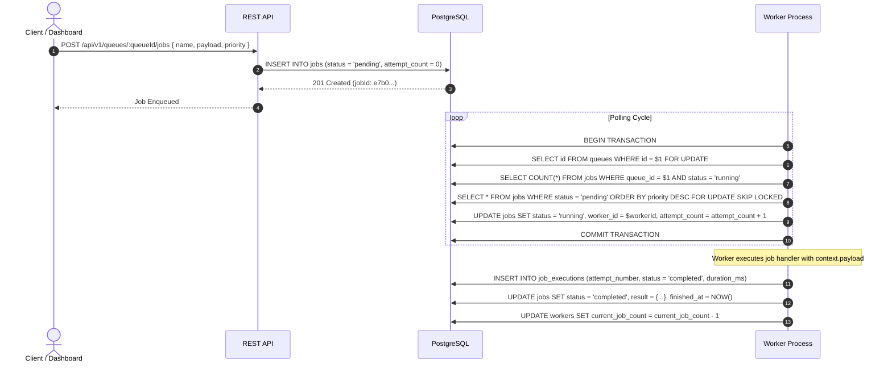
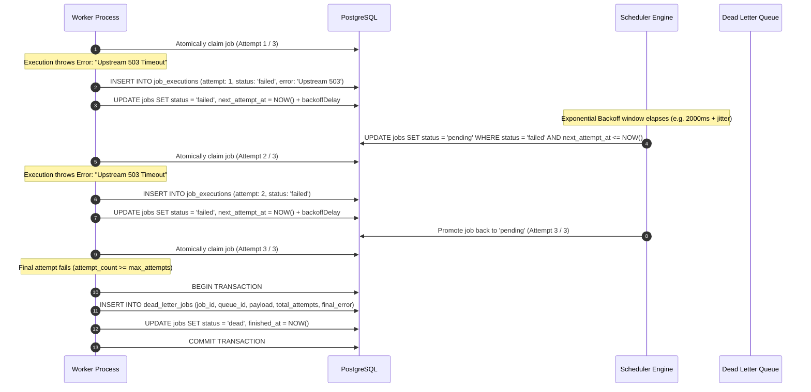

# Distributed Job Scheduler — System Architecture & Internals

Comprehensive architectural documentation for the high-throughput, multi-tenant **Distributed Job Scheduler** platform.

---

## 1. High-Level Architecture Diagram

---

## 2. Core Architectural Components

### 2.1 React Web Dashboard (`frontend/`)

- **Technology**: React 18, TypeScript, Vite, Tailwind CSS, Lucide Icons, Recharts.
- **Role**: Provides real-time visibility into queue depths, active worker nodes, running/pending/completed jobs, and quarantined Dead Letter Queue (DLQ) records. Includes interactive job dispatching, log inspection, and 20-item paginated backlog telemetry.

### 2.2 Express REST API Gateway (`backend/api/`)

- **Technology**: Express.js, TypeScript, Zod Schema Validation, Helmet, Morgan, Winston.
- **Role**: Entry point for users, microservices, and external systems. Handles:
  - **Authentication & RBAC**: JWT Bearer validation with `HS256` lockdown and SHA-256 API Key authorization.
  - **Multi-Tenant Isolation**: Enforces tenant-boundary checks across Organizations, Projects, Queues, and Jobs.
  - **Job Ingestion**: Immediate enqueuing, batch submissions (up to 1,000 jobs per transaction), and recurring cron job template registration.
  - **Telemetry & Prometheus Export**: Real-time aggregation of p50/p95/p99 duration percentiles and Prometheus exposition text output (`/api/v1/metrics/prometheus`).

### 2.3 Distributed Scheduler Service (`backend/scheduler/`)

- **Technology**: Node.js, `cron-parser`, Redis Redlock distributed locking.
- **Role**: Runs as a resilient standalone daemon or clustered service:
  - **Delayed Job Promotion**: Periodically queries `jobs WHERE status = 'scheduled' AND scheduled_at <= NOW()` and promotes them to `'pending'`.
  - **Cron Execution Engine**: Evaluates standard 5-field cron schedules, calculates `next_run_at`, and generates concrete pending job instances before scheduled execution windows.
  - **Leader Election**: Uses Redis distributed locks (`redlock:scheduler:leader`) so that only one active scheduler instance evaluates cron intervals at a time, eliminating duplicate job generation.

### 2.4 Worker Fleet (`backend/worker/`)

- **Technology**: Node.js async execution runtime, worker concurrency pools.
- **Role**: Distributed workers that poll active queues, claim batches of jobs atomically, and execute registered handlers:
  - **Concurrency Control**: Enforces worker-level concurrency capacity and queue-level concurrency limits.
  - **Liveness & Heartbeats**: Emits background heartbeats every 5 seconds to `workers` and `worker_heartbeats`.
  - **Graceful Shutdown**: Intercepts `SIGTERM` / `SIGINT` signals, transitions to `draining` status, completes in-flight jobs within a configurable grace period, and cleanly releases resources.

### 2.5 PostgreSQL Persistence & State Machine (`backend/shared/src/db/`)

- **Technology**: PostgreSQL 14+, connection pooling (`pg.Pool`), strict foreign keys, and indexes.
- **Role**: Acts as the single source of truth for all system state. Concurrency is guaranteed at the database engine level via `SELECT ... FOR UPDATE SKIP LOCKED` and row-level locks.

---

## 3. End-to-End Execution Lifecycles

### Flow A: Successful Job Execution (Happy Path)

#### Step-by-Step Explanation:

1. **Creation**: The client submits a job specification to `POST /api/v1/queues/:queueId/jobs`.
2. **Persistence**: The API validates the payload with Zod and inserts a row into `jobs` with `status = 'pending'`, `attempt_count = 0`, and `enqueued_at = NOW()`.
3. **Atomic Claim**:
   - An active worker checks its capacity (`availableSlots = maxConcurrency - currentJobCount`).
   - If slots are available, it starts a transaction, acquires an exclusive lock on the queue row to serialize concurrency limits, and runs `SELECT ... FOR UPDATE SKIP LOCKED`.
   - The claimed job's status atomically transitions to `'running'`, `attempt_count` increments to `1`, and `started_at` is stamped.
4. **Execution**: The worker dispatches the job payload to the registered TypeScript handler function.
5. **Success Stamping**: Upon successful completion, the worker records a `job_executions` record containing duration, updates `jobs` to `status = 'completed'`, and frees the concurrency slot.

---

### Flow B: Job Failure, Exponential Retry & DLQ Transition

#### Step-by-Step Explanation:

1. **Initial Failure**: A claimed job throws an unhandled exception or times out.
2. **Attempt Recording**: The worker records the attempt failure in `job_executions` with error message, stack, and execution duration.
3. **Exponential Backoff Calculation**:
   - The retry policy evaluates the delay:
     $$\text{delay} = \min\left(\text{maxDelayMs}, \text{initialDelayMs} \times (\text{backoffMultiplier})^{\text{attempt} - 1} + \text{random}(\text{jitterMs})\right)$$
   - The job is stamped with `next_attempt_at = NOW() + delay` and `status = 'failed'`.
4. **Retry Promotion**: The scheduler or worker daemon checks for failed jobs whose `next_attempt_at <= NOW()` and promotes them back to `'pending'`.
5. **Exhaustion & DLQ Quarantine**:
   - When a job fails on its terminal attempt (`attempt_count >= max_attempts`):
     - An atomic database transaction inserts a comprehensive snapshot of the job definition, arguments, payload, and final stack trace into `dead_letter_jobs`.
     - The job in `jobs` transitions to `status = 'dead'`, quarantining it from further worker execution.
6. **Manual / Programmatic Recovery**: Operators can inspect DLQ entries in the dashboard and trigger `POST /api/v1/dlq/:dlqId/retry` to replay the job into its original queue.

---

## 4. Concurrency, Race Condition & Failure Handling

| Scenario                                | Architectural Mechanism                                                                                               | Guarantee                                                                                                                                    |
| --------------------------------------- | --------------------------------------------------------------------------------------------------------------------- | -------------------------------------------------------------------------------------------------------------------------------------------- |
| **Two Workers Claiming Same Job**       | `SELECT ... FOR UPDATE SKIP LOCKED`                                                                                   | Zero duplicate claims. Only one worker acquires the row lock; other workers skip to subsequent jobs without blocking.                        |
| **Queue Concurrency Overflow**          | Two-statement sequential queue row locking (`SELECT id FROM queues FOR UPDATE` followed by fresh running count query) | In-flight jobs on any queue strictly never exceed `concurrency_limit` even under high concurrency.                                           |
| **Duplicate Scheduler Instances**       | Redis Redlock distributed mutex (`redlock:scheduler:leader`) with automatic renewal                                   | Only the active leader instance triggers cron intervals. Secondary schedulers remain in hot-standby mode.                                    |
| **Worker Node Hard Crash / Power Loss** | Background Stale Worker Scanner (`POST /api/v1/workers/stale/scan`)                                                   | Workers missing heartbeats for $>30\text{s}$ are reaped to `unhealthy`. Abandoned running jobs are recovered and rescheduled.                |
| **Worker Stale State Fencing**          | Worker ownership check in `completeJob()` and `failJob()` (`WHERE id = $1 AND worker_id = $2`)                        | If a slow worker resumes after being reaped, its attempt to complete or fail a reassigned job is rejected without corrupting state.          |
| **Transaction Rollback Atomicity**      | PostgreSQL multi-statement atomic transactions (`BEGIN ... COMMIT / ROLLBACK`)                                        | Database operations (job claim + worker slot increment, DLQ insertion + job death) succeed or fail as single atomic units.                   |
| **Job Cancellation Race**               | State Machine Guard (`assertStateTransition`)                                                                         | Cancelling a running or completed job raises a domain exception, preventing race conditions between user cancellation and worker completion. |
| **Priority Inversion**                  | Strict Composite Indexing `(status, priority DESC, enqueued_at ASC)`                                                  | Higher priority jobs (P10) are always claimed and executed before lower priority jobs (P1) regardless of submission time.                    |
| **Poison-Pill / Corrupt Payload**       | Quarantined Dead Letter Queue (`dead_letter_jobs`)                                                                    | Unrecoverable jobs are isolated after $N$ attempts without blocking or degrading processing of healthy jobs in the queue.                    |
| **Credential Stuffing & DoS**           | Dual Rate Limiter (Global 300 req/min + Auth 50 req/15 min) + `1mb` Body Limit                                        | Protects authentication endpoints from brute-force password guessing and server memory from payload exhaustion.                              |
