# Database Design

## Distributed Job Scheduler — PostgreSQL Schema

---

## Table of Contents

1. [Design Principles](#design-principles)
2. [ER Diagram](#er-diagram)
3. [Table Reference](#table-reference)
4. [Index Reference](#index-reference)
5. [Query Patterns](#query-patterns)
6. [Cascade Rules](#cascade-rules)
7. [Trigger Reference](#trigger-reference)
8. [Views](#views)

---

## Design Principles

| Principle | Decision |
|---|---|
| **PostgreSQL as source of truth** | All job state lives in PG. Redis is only used for leader election and pub/sub. |
| **Atomic job claiming** | `SELECT … FOR UPDATE SKIP LOCKED` — no application-level locking needed |
| **Normalized retry policies** | Separate `retry_policies` table instead of JSONB blob — queryable, reusable, auditable |
| **Execution history separated** | `job_executions` is one row per attempt, `jobs` is one row per logical job |
| **BIGSERIAL for high-volume logs** | `job_logs.id` is BIGSERIAL not UUID — avoids random index page splits at high insert rates |
| **Partial indexes everywhere** | Indexes on `jobs` use `WHERE status = 'pending'` etc. — keeps index size tiny as table grows |
| **GENERATED columns** | `job_executions.duration_ms` is computed from timestamps — always consistent, zero maintenance |
| **Batch counters via trigger** | `batch_groups` counters stay accurate without application bookkeeping |
| **Deliberate CASCADE rules** | Deleting an org cascades to projects → queues → jobs. Worker death sets `worker_id = NULL` (not cascade) so jobs are re-claimable |
| **Snapshots in DLQ** | `dead_letter_jobs` stores a payload + error snapshot so DLQ APIs don't need to JOIN back to `jobs` |

---

## ER Diagram

```mermaid
erDiagram

    %% ─── IDENTITY & ACCESS ─────────────────────────────────────────

    users {
        uuid        id              PK
        varchar     email           UK
        varchar     password_hash
        varchar     name
        boolean     is_active
        timestamptz last_login_at
        timestamptz created_at
        timestamptz updated_at
    }

    organizations {
        uuid        id          PK
        varchar     name
        varchar     slug        UK
        boolean     is_active
        timestamptz created_at
        timestamptz updated_at
    }

    organization_members {
        uuid        id              PK
        uuid        organization_id FK
        uuid        user_id         FK
        org_role    role
        uuid        invited_by_id   FK
        timestamptz created_at
        timestamptz updated_at
    }

    projects {
        uuid        id              PK
        uuid        organization_id FK
        varchar     name
        varchar     slug
        text        description
        boolean     is_active
        timestamptz created_at
        timestamptz updated_at
    }

    api_keys {
        uuid        id           PK
        uuid        project_id   FK
        uuid        created_by   FK
        varchar     name
        varchar     key_hash     UK
        varchar     key_prefix
        text_array  scopes
        timestamptz expires_at
        timestamptz last_used_at
        timestamptz revoked_at
        timestamptz created_at
    }

    %% ─── RETRY POLICIES ────────────────────────────────────────────

    retry_policies {
        uuid            id                 PK
        uuid            project_id         FK
        varchar         name
        retry_strategy  strategy
        smallint        max_attempts
        int             initial_delay_ms
        int             max_delay_ms
        numeric         backoff_multiplier
        int             jitter_ms
        timestamptz     created_at
        timestamptz     updated_at
    }

    %% ─── QUEUES ─────────────────────────────────────────────────────

    queues {
        uuid         id                    PK
        uuid         project_id            FK
        uuid         retry_policy_id       FK
        varchar      name
        smallint     priority
        int          concurrency_limit
        int          rate_limit_per_minute
        int          job_timeout_ms
        queue_status status
        boolean      dlq_enabled
        timestamptz  paused_at
        timestamptz  created_at
        timestamptz  updated_at
    }

    %% ─── WORKERS ────────────────────────────────────────────────────

    workers {
        uuid          id                PK
        uuid          project_id        FK
        varchar       hostname
        inet          ip_address
        int           pid
        varchar       version
        worker_status status
        int           max_concurrency
        int           current_job_count
        timestamptz   last_heartbeat_at
        timestamptz   registered_at
        timestamptz   created_at
        timestamptz   updated_at
    }

    worker_queue_subscriptions {
        uuid        worker_id     FK
        uuid        queue_id      FK
        timestamptz subscribed_at
    }

    worker_heartbeats {
        bigint        id                PK
        uuid          worker_id         FK
        worker_status status
        int           current_job_count
        jsonb         metadata
        timestamptz   created_at
    }

    %% ─── JOBS ───────────────────────────────────────────────────────

    batch_groups {
        uuid        id              PK
        uuid        project_id      FK
        varchar     name
        int         total_count
        int         pending_count
        int         running_count
        int         completed_count
        int         failed_count
        int         dead_count
        timestamptz created_at
        timestamptz updated_at
    }

    jobs {
        uuid        id               PK
        uuid        queue_id         FK
        uuid        worker_id        FK
        uuid        batch_group_id   FK
        uuid        scheduled_job_id FK
        varchar     name
        job_type    type
        job_status  status
        jsonb       payload
        smallint    priority
        timestamptz scheduled_at
        timestamptz run_at
        smallint    attempt_count
        smallint    max_attempts
        timestamptz next_attempt_at
        int         timeout_ms
        jsonb       result
        text        error_message
        varchar     error_code
        timestamptz enqueued_at
        timestamptz started_at
        timestamptz finished_at
        timestamptz created_at
        timestamptz updated_at
    }

    job_executions {
        uuid        id             PK
        uuid        job_id         FK
        uuid        worker_id      FK
        smallint    attempt_number
        varchar     status
        timestamptz started_at
        timestamptz finished_at
        int         duration_ms    "GENERATED"
        jsonb       result
        text        error_message
        varchar     error_code
        varchar     exit_signal
        timestamptz next_retry_at
        int         retry_delay_ms
        timestamptz created_at
    }

    job_logs {
        bigint      id           PK
        uuid        job_id       FK
        uuid        execution_id FK
        log_level   level
        text        message
        jsonb       metadata
        timestamptz logged_at
    }

    %% ─── SCHEDULED JOBS ─────────────────────────────────────────────

    scheduled_jobs {
        uuid        id               PK
        uuid        queue_id         FK
        uuid        retry_policy_id  FK
        varchar     name
        varchar     cron_expression
        varchar     timezone
        jsonb       payload_template
        smallint    priority
        int         timeout_ms
        smallint    max_attempts
        boolean     enabled
        boolean     skip_if_running
        timestamptz last_fired_at
        timestamptz next_run_at
        uuid        last_job_id      FK
        bigint      run_count
        bigint      fail_count
        timestamptz created_at
        timestamptz updated_at
    }

    %% ─── DEAD LETTER QUEUE ──────────────────────────────────────────

    dead_letter_jobs {
        uuid        id                  PK
        uuid        job_id              FK  "UNIQUE"
        uuid        queue_id            FK
        varchar     name
        jsonb       payload
        smallint    total_attempts
        text        final_error_message
        varchar     final_error_code
        timestamptz first_failed_at
        timestamptz last_failed_at
        timestamptz moved_to_dlq_at
        timestamptz requeued_at
        uuid        requeued_job_id     FK
        uuid        requeued_by         FK
        timestamptz created_at
    }

    %% ─── METRICS ────────────────────────────────────────────────────

    queue_metrics {
        uuid        id               PK
        uuid        queue_id         FK
        date        date
        bigint      enqueued_count
        bigint      completed_count
        bigint      failed_count
        bigint      dead_count
        bigint      cancelled_count
        numeric     avg_wait_ms
        numeric     p50_wait_ms
        numeric     p95_wait_ms
        numeric     p99_wait_ms
        numeric     avg_duration_ms
        numeric     p50_duration_ms
        numeric     p95_duration_ms
        numeric     p99_duration_ms
        timestamptz updated_at
    }

    %% ─── RELATIONSHIPS ──────────────────────────────────────────────

    users                    ||--o{ organization_members    : "belongs to"
    organizations            ||--o{ organization_members    : "has members"
    users                    ||--o{ organization_members    : "invited_by"
    organizations            ||--o{ projects                : "owns"
    projects                 ||--o{ api_keys                : "has"
    users                    ||--o{ api_keys                : "created_by"
    projects                 ||--o{ retry_policies          : "defines"
    projects                 ||--o{ queues                  : "has"
    projects                 ||--o{ workers                 : "has"
    projects                 ||--o{ batch_groups            : "has"
    retry_policies           ||--o{ queues                  : "applied to"
    retry_policies           ||--o{ scheduled_jobs          : "applied to"
    queues                   ||--o{ worker_queue_subscriptions : "subscribed by"
    workers                  ||--o{ worker_queue_subscriptions : "subscribes to"
    workers                  ||--o{ worker_heartbeats       : "emits"
    queues                   ||--o{ jobs                    : "contains"
    workers                  ||--o{ jobs                    : "claims"
    batch_groups             ||--o{ jobs                    : "groups"
    scheduled_jobs           ||--o{ jobs                    : "spawns"
    jobs                     ||--o{ job_executions          : "has attempts"
    workers                  ||--o{ job_executions          : "executed by"
    jobs                     ||--o{ job_logs                : "has logs"
    job_executions           ||--o{ job_logs                : "scoped to"
    queues                   ||--o{ scheduled_jobs          : "hosts"
    jobs                     ||--o{ dead_letter_jobs        : "becomes"
    queues                   ||--o{ dead_letter_jobs        : "holds"
    jobs                     ||--o{ dead_letter_jobs        : "requeued_as"
    users                    ||--o{ dead_letter_jobs        : "requeued_by"
    queues                   ||--o{ queue_metrics           : "measured by"
```



---

## Table Reference

### `users`
Root authentication entity. One user can belong to many organisations.

| Column | Type | Notes |
|---|---|---|
| `id` | UUID PK | `gen_random_uuid()` |
| `email` | VARCHAR(255) UNIQUE NOT NULL | Checked by regex |
| `password_hash` | VARCHAR(255) NOT NULL | bcrypt, cost ≥ 12 |
| `is_active` | BOOLEAN | `FALSE` = soft-deleted |
| `last_login_at` | TIMESTAMPTZ | Updated on successful auth |

---

### `organizations`
Top-level multi-tenant boundary. All resources belong to an org.

| Column | Type | Notes |
|---|---|---|
| `slug` | VARCHAR(64) UNIQUE | Lowercase alphanumeric + hyphens |

---

### `organization_members`
Many-to-many: users ↔ organizations with RBAC.

| Role | Description |
|---|---|
| `owner` | Full control, cannot be removed |
| `admin` | Manage projects and queues |
| `member` | Submit jobs, view results |
| `viewer` | Read-only |

---

### `retry_policies`
Normalized retry configuration. Referenced by queues and scheduled_jobs.

| Strategy | Delay Formula |
|---|---|
| `fixed` | always `initial_delay_ms` |
| `linear` | `initial_delay_ms × attempt_number` |
| `exponential` | `min(initial_delay_ms × multiplier^(n-1), max_delay_ms) ± jitter` |

---

### `queues`
Primary throughput and isolation boundary.

| Column | Notes |
|---|---|
| `priority` | 1=highest, 10=lowest. Cross-queue ordering by workers |
| `concurrency_limit` | Max simultaneous running jobs across **all** workers |
| `paused_at` | CHECK constraint: must be set iff `status = 'paused'` |
| `dlq_enabled` | When TRUE, dead jobs move to `dead_letter_jobs` |

---

### `jobs` ⚡ High-volume
One row per submitted job. The most-queried table in the system.

| Column | Notes |
|---|---|
| `status` | FSM: `pending → running → completed/failed → dead` |
| `priority` | Job-level priority overrides queue priority |
| `scheduled_at` | `NULL` = immediate. Set for delayed/scheduled/recurring |
| `next_attempt_at` | Set after failure. Worker skips if in the future |
| `attempt_count` | Incremented on each claim. `≤ max_attempts` (CHECK) |
| `worker_id` | `SET NULL` on worker death — makes job re-claimable |
| `run_at` | Stamped when `status → running`. Used for wait-time metrics |

**Job FSM:**
```
                    ┌─────────────────────────────────────────────┐
                    │                                             ▼
[submit] → pending ──► running ──► completed                  cancelled
               ▲         │
               │         └──► failed ──► (retry) ──► pending
               │                   │
               │                   └──► (max attempts) ──► dead ──► dead_letter_jobs
               │
           scheduled ──► (scheduled_at passes) ──► pending
```

---

### `job_executions`
One row per attempt. Separates retry history from the job itself.

| Column | Notes |
|---|---|
| `attempt_number` | 1-based. UNIQUE with `job_id` |
| `duration_ms` | **GENERATED STORED** — `(finished_at - started_at)` in ms |
| `next_retry_at` | When the next attempt is eligible |
| `exit_signal` | e.g. `SIGKILL` if worker was force-killed |

---

### `job_logs`
Append-only execution log. Uses `BIGSERIAL` PK (not UUID) to avoid random index page splits at high insert rates.

| Column | Notes |
|---|---|
| `execution_id` | `NULL` = job-level log. Non-null = specific attempt |
| `metadata` | Structured context: `{"step":"fetch","ms":42}` |

---

### `scheduled_jobs`
Cron/recurring job templates polled by the Scheduler service.

| Column | Notes |
|---|---|
| `cron_expression` | Standard 5-field cron. Validated by application |
| `timezone` | IANA timezone. Default `UTC` |
| `skip_if_running` | `TRUE` = skip if `last_job_id` still running (prevents overlap) |
| `next_run_at` | Updated atomically by Scheduler after each fire |

---

### `dead_letter_jobs`
Snapshot of jobs that exhausted all retries.

| Column | Notes |
|---|---|
| `job_id` | UNIQUE — one DLQ row per dead job |
| `payload` | Denormalized snapshot — DLQ APIs don't need a JOIN |
| `requeued_job_id` | Points to the new job created by manual re-queue |

---

## Index Reference

| # | Index Name | Table | Columns | Partial? | Supports |
|---|---|---|---|---|---|
| 1 | `idx_jobs_claim` | `jobs` | `(queue_id, priority DESC, enqueued_at ASC)` | `WHERE status='pending'` | Job claim query |
| 2 | `idx_jobs_scheduled_promotion` | `jobs` | `(scheduled_at ASC)` | `WHERE status='scheduled'` | Scheduled job promotion |
| 3 | `idx_jobs_retry_eligible` | `jobs` | `(next_attempt_at ASC)` | `WHERE status='failed'` | Retry re-queuing |
| 4 | `idx_jobs_running_per_queue` | `jobs` | `(queue_id)` | `WHERE status='running'` | Concurrency gate |
| 5 | `idx_jobs_running_by_worker` | `jobs` | `(worker_id)` | `WHERE status='running'` | Stale job reaper |
| 6 | `idx_jobs_queue_status_updated` | `jobs` | `(queue_id, status, updated_at DESC)` | — | API job listing |
| 7 | `idx_jobs_batch_group` | `jobs` | `(batch_group_id)` | `WHERE batch_group_id IS NOT NULL` | Batch progress |
| 8 | `idx_jobs_scheduled_job_id` | `jobs` | `(scheduled_job_id, created_at DESC)` | `WHERE NOT NULL` | Cron run history |
| 9 | `UNIQUE(job_id, attempt_number)` | `job_executions` | `(job_id, attempt_number)` | — | Retry history lookup |
| 10 | `idx_job_executions_worker` | `job_executions` | `(worker_id, started_at DESC)` | `WHERE NOT NULL` | Worker's job history |
| 11 | `idx_job_logs_job_time` | `job_logs` | `(job_id, logged_at ASC)` | — | Stream job logs |
| 12 | `idx_job_logs_job_level` | `job_logs` | `(job_id, level, logged_at ASC)` | — | Filter logs by level |
| 13 | `idx_workers_active_heartbeat` | `workers` | `(last_heartbeat_at ASC)` | `WHERE status='active'` | Dead worker detection |
| 14 | `idx_workers_project` | `workers` | `(project_id, registered_at DESC)` | — | List workers |
| 15 | `idx_worker_heartbeats_worker_time` | `worker_heartbeats` | `(worker_id, created_at DESC)` | — | Recent heartbeats |
| 16 | `idx_scheduled_jobs_due` | `scheduled_jobs` | `(next_run_at ASC)` | `WHERE enabled=TRUE` | Cron dispatcher |
| 17 | `idx_dlq_queue_time` | `dead_letter_jobs` | `(queue_id, moved_to_dlq_at DESC)` | `WHERE requeued_at IS NULL` | DLQ listing |
| 18 | `UNIQUE(queue_id, date)` | `queue_metrics` | `(queue_id, date)` | — | Metrics time series |
| 19 | `UNIQUE(key_hash)` | `api_keys` | `(key_hash)` | — | API key auth lookup |
| 20 | `idx_org_members_user` | `organization_members` | `(user_id)` | — | User's org list |

---

## Query Patterns

### 1. Claim the next job for a worker (most critical)

```sql
-- Runs every poll interval (~1s) per worker.
-- SKIP LOCKED means concurrent workers never block each other.
-- partial index idx_jobs_claim makes this a tiny index seek.

BEGIN;

-- Check concurrency limit first
SELECT COUNT(*) FROM jobs
WHERE queue_id = $queue_id
  AND status = 'running';           -- uses idx_jobs_running_per_queue

-- Claim if under limit
UPDATE jobs SET
    status    = 'running',
    worker_id = $worker_id,
    run_at    = NOW(),
    attempt_count = attempt_count + 1,
    updated_at    = NOW()
WHERE id = (
    SELECT id FROM jobs
    WHERE queue_id = $queue_id
      AND status   = 'pending'       -- idx_jobs_claim (partial on status='pending')
      AND (scheduled_at IS NULL OR scheduled_at <= NOW())
      AND (next_attempt_at IS NULL   OR next_attempt_at <= NOW())
    ORDER BY priority DESC, enqueued_at ASC
    LIMIT 1
    FOR UPDATE SKIP LOCKED
)
RETURNING *;

COMMIT;
```

### 2. Promote delayed / scheduled jobs

```sql
-- Scheduler runs this every 5s.
-- Moves jobs whose scheduled_at has passed from 'scheduled' → 'pending'.

UPDATE jobs
SET    status     = 'pending',
       updated_at = NOW()
WHERE  status       = 'scheduled'          -- idx_jobs_scheduled_promotion
  AND  scheduled_at <= NOW()
RETURNING id, queue_id, name;
```

### 3. Re-queue failed jobs eligible for retry

```sql
-- Scheduler runs this every 5s.
-- Moves status='failed' jobs whose next_attempt_at has passed back to 'pending'.

UPDATE jobs
SET    status          = 'pending',
       updated_at      = NOW()
WHERE  status          = 'failed'          -- idx_jobs_retry_eligible
  AND  next_attempt_at <= NOW()
RETURNING id, queue_id, attempt_count, max_attempts;
```

### 4. Mark a job as failed after execution error

```sql
BEGIN;

-- Record the attempt
INSERT INTO job_executions
    (job_id, worker_id, attempt_number, status, started_at, finished_at,
     error_message, error_code, next_retry_at, retry_delay_ms)
VALUES ($1, $2, $3, 'failed', $4, NOW(), $5, $6, $7, $8);

-- Update job: either retry or die
UPDATE jobs SET
    status          = CASE
                        WHEN attempt_count >= max_attempts THEN 'dead'
                        ELSE 'failed'
                      END,
    worker_id       = NULL,
    error_message   = $5,
    error_code      = $6,
    next_attempt_at = $7,   -- NULL when dead
    finished_at     = CASE WHEN attempt_count >= max_attempts THEN NOW() ELSE NULL END,
    updated_at      = NOW()
WHERE id = $1
RETURNING status, attempt_count, max_attempts;

COMMIT;
```

### 5. Find retry history for a job

```sql
-- GET /jobs/:id/executions
-- UNIQUE index on (job_id, attempt_number) covers this.

SELECT
    attempt_number,
    status,
    started_at,
    finished_at,
    duration_ms,      -- GENERATED column
    error_message,
    error_code,
    next_retry_at
FROM job_executions
WHERE  job_id = $job_id
ORDER  BY attempt_number ASC;
```

### 6. Find dead-letter jobs for a queue

```sql
-- GET /queues/:id/dlq
-- idx_dlq_queue_time covers (queue_id, moved_to_dlq_at DESC) WHERE requeued_at IS NULL

SELECT
    dlq.id,
    dlq.name,
    dlq.payload,
    dlq.total_attempts,
    dlq.final_error_message,
    dlq.final_error_code,
    dlq.moved_to_dlq_at
FROM   dead_letter_jobs dlq
WHERE  dlq.queue_id    = $queue_id
  AND  dlq.requeued_at IS NULL          -- only un-requeued entries
ORDER  BY dlq.moved_to_dlq_at DESC
LIMIT  50 OFFSET $offset;
```

### 7. Detect dead workers and reclaim their jobs

```sql
-- Scheduler runs this every 30s.
-- v_dead_workers = active workers with last_heartbeat_at < NOW() - 60s

BEGIN;

UPDATE workers
SET    status     = 'offline',
       updated_at = NOW()
WHERE  id IN (SELECT id FROM v_dead_workers);

UPDATE jobs
SET    status     = 'pending',
       worker_id  = NULL,
       updated_at = NOW()
WHERE  status    = 'running'              -- idx_jobs_running_by_worker
  AND  worker_id IN (SELECT id FROM v_dead_workers)
RETURNING id, queue_id;

COMMIT;
```

### 8. Retrieve execution logs for a job

```sql
-- GET /jobs/:id/logs
-- idx_job_logs_job_time covers (job_id, logged_at ASC)

SELECT
    id,
    level,
    message,
    metadata,
    logged_at,
    execution_id
FROM   job_logs
WHERE  job_id = $job_id
ORDER  BY logged_at ASC;
```

### 9. Queue statistics (live concurrency view)

```sql
-- Uses v_queue_stats view (backed by idx_jobs_running_per_queue etc.)
SELECT * FROM v_queue_stats WHERE queue_id = $queue_id;
```

### 10. Cron dispatcher — fire scheduled jobs

```sql
-- Scheduler polls every minute.
-- SKIP LOCKED means multiple scheduler replicas can't double-fire.

BEGIN;

SELECT * FROM scheduled_jobs
WHERE  enabled     = TRUE
  AND  next_run_at <= NOW()        -- idx_scheduled_jobs_due
ORDER  BY next_run_at ASC
LIMIT  100
FOR UPDATE SKIP LOCKED;

-- For each definition: INSERT a new jobs row, UPDATE next_run_at

COMMIT;
```

---

## Cascade Rules

| Relationship | ON DELETE | Reason |
|---|---|---|
| `org_members → users` | CASCADE | Remove org memberships when user deleted |
| `org_members → organizations` | CASCADE | Remove memberships when org deleted |
| `projects → organizations` | CASCADE | Deleting org destroys all projects |
| `queues → projects` | CASCADE | Deleting project destroys all queues |
| `jobs → queues` | CASCADE | Deleting queue destroys all its jobs |
| `job_executions → jobs` | CASCADE | Attempts are meaningless without the job |
| `job_logs → jobs` | CASCADE | Logs are meaningless without the job |
| `dead_letter_jobs → jobs` | CASCADE | DLQ entry tracks the dead job |
| `worker_heartbeats → workers` | CASCADE | Heartbeat log scoped to worker |
| `jobs.worker_id → workers` | **SET NULL** | Worker death must NOT delete jobs — they become re-claimable |
| `job_executions.worker_id → workers` | **SET NULL** | Historical record kept, worker ref cleared |
| `queues.retry_policy_id → retry_policies` | **SET NULL** | Queue falls back to defaults if policy deleted |
| `scheduled_jobs.last_job_id → jobs` | **SET NULL** | History pointer, not a dependency |

---

## Trigger Reference

### `fn_set_updated_at`
Applied to 11 tables via a `DO` loop. Fires `BEFORE UPDATE`, sets `NEW.updated_at = NOW()`.

```sql
-- Applied to: users, organizations, organization_members, projects,
--             retry_policies, queues, workers, batch_groups,
--             jobs, scheduled_jobs, queue_metrics
```

### `fn_update_batch_counts`
Fires `AFTER INSERT OR UPDATE OF status ON jobs` when `batch_group_id IS NOT NULL`.

- **INSERT** → increments `total_count` and `pending_count`
- **UPDATE (status change)** → decrements old status bucket, increments new bucket

This keeps `batch_groups` counters accurate without application-layer bookkeeping, allowing O(1) batch progress queries.

---

## Views

### `v_pending_jobs`
Shows all claimable jobs (status=pending, queue active, past scheduled time).
Used by workers as the basis for their claim query.

### `v_queue_stats`
Live per-queue job counts (running, pending, failed, dead, scheduled).
Used by the dashboard for real-time concurrency display.

### `v_dead_workers`
Active workers that have not heartbeated in >60 seconds.
Used by the stale-job reaper in the Scheduler service.

---

## Running Migrations

```powershell
# Using local PostgreSQL 17
$psql = "C:\Program Files\PostgreSQL\17\bin\psql.exe"

# Run in order
& $psql -U postgres -d job_scheduler -f "database/migrations/001_initial_schema.sql"
& $psql -U postgres -d job_scheduler -f "database/migrations/002_complete_schema.sql"
& $psql -U postgres -d job_scheduler -f "database/seeds/001_dev_seed.sql"

# Using Docker
docker exec -i js_postgres psql -U postgres -d job_scheduler `
  < database/migrations/002_complete_schema.sql
```
